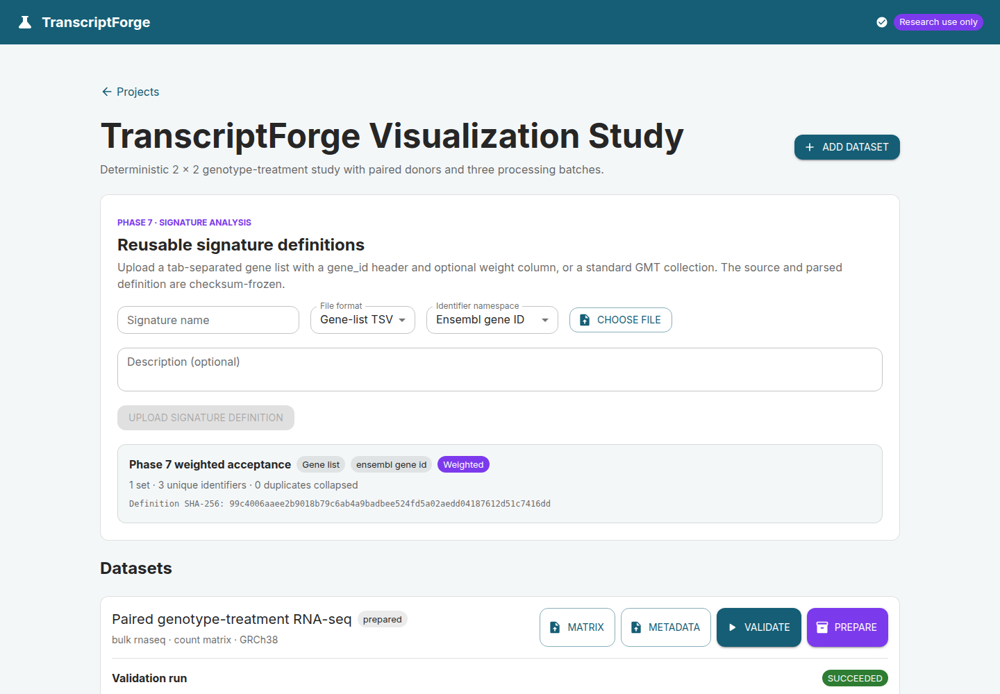
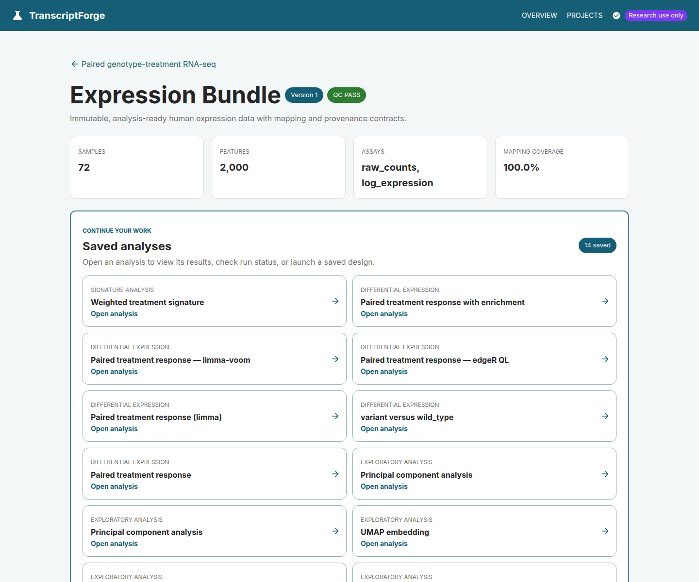
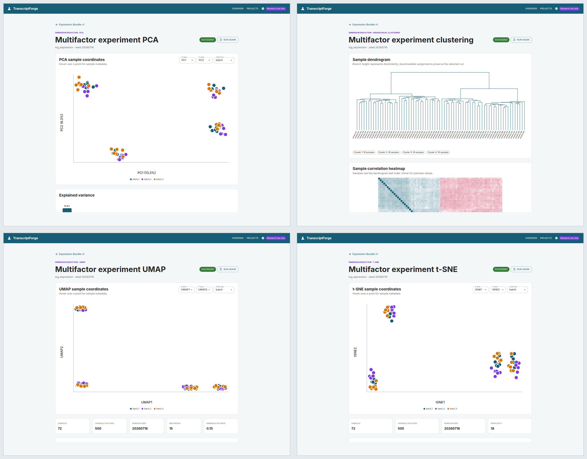
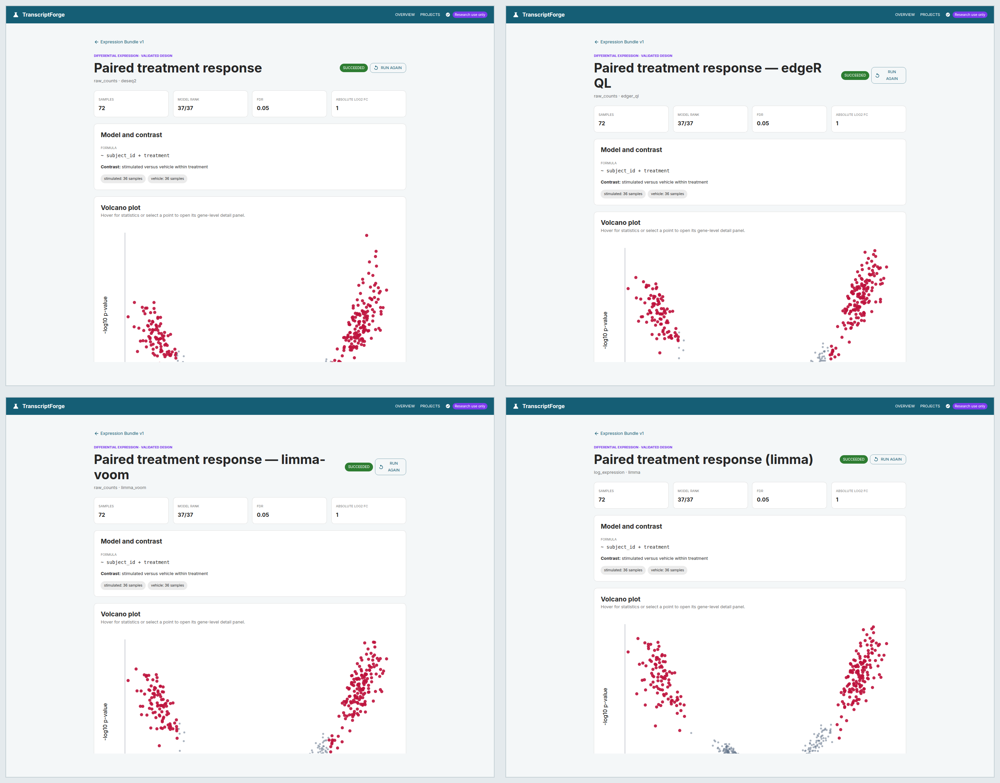
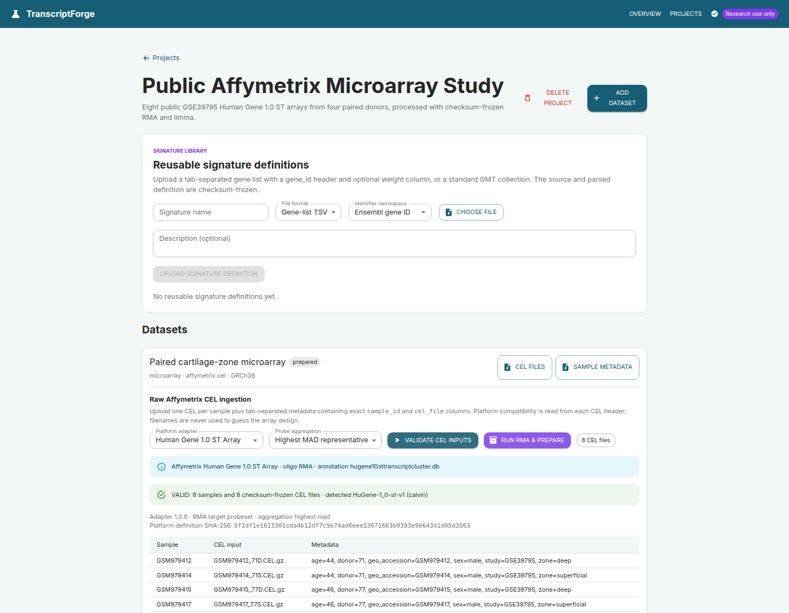
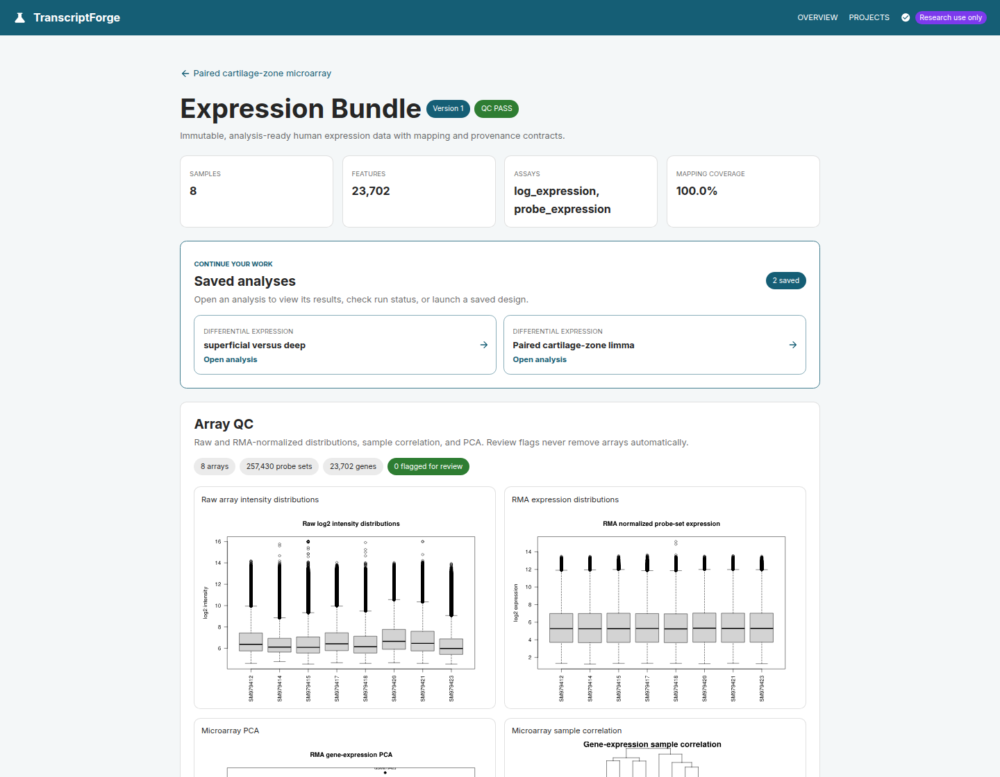
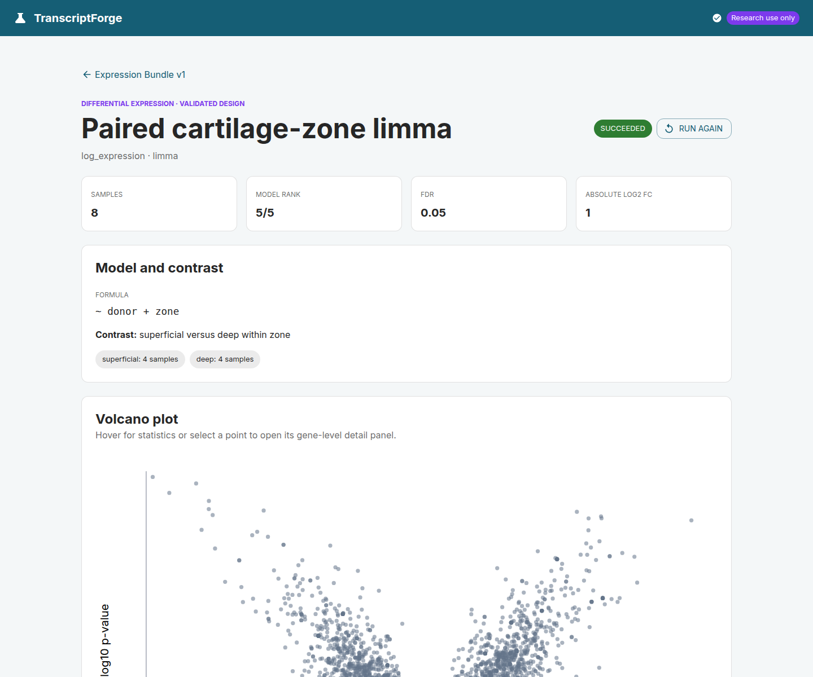
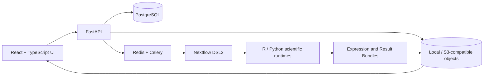

# TranscriptForge

**A full-stack, workflow-backed workbench for reproducible human transcriptomics.**

TranscriptForge takes researchers from uploaded RNA-seq or Affymetrix data to quality-controlled,
analysis-ready Expression Bundles, interactive exploration, differential expression, enrichment,
and gene-signature scoring. Every scientific run crosses a typed contract boundary, executes through
Nextflow, and publishes immutable results with checksums and software provenance.


## What this project demonstrates

| Area | Evidence in the repository |
| --- | --- |
| Product engineering | React/TypeScript workflows for projects, uploads, live run state, QC, analysis design, interactive plots, tables, downloads, and provenance |
| Backend engineering | Typed FastAPI services, async SQLAlchemy/PostgreSQL persistence, Alembic migrations, object-storage adapters, and bounded Celery workers |
| Workflow engineering | Nextflow DSL2 routes for matrix preparation, raw RNA-seq, Affymetrix RMA, exploration, differential expression, enrichment, and signature scoring |
| Scientific computing | Tested Python and R implementations using NumPy/SciPy/scikit-learn, DESeq2, edgeR, limma, GSVA, and Bioconductor platform packages |
| Reproducibility | Frozen request JSON, SHA-256 input and artifact identities, immutable Expression Bundles, deterministic seeds, container/runtime versions, and downloadable execution provenance |
| Cloud architecture | Optional AWS Batch/S3/ECR/KMS/Terraform profile with scale-to-zero compute, checksum-keyed S3 references, and no persistent EFS dependency |

## Product walkthrough

### RNA-seq: inputs to interpretable results

The primary visualization study is a deterministic 72-library experiment: 36 paired donors, two
treatments, two genotypes, and three balanced processing batches across 2,000 simulated genes. The
known-effect and null blocks let the workflow test model behavior and reproducibility without
presenting simulated biology as external validation.

#### 1. Register the study and validate the input contract

RNA-seq can enter as a feature-count matrix or as paired-/single-end FASTQ. Raw ingestion binds every
sample and lane to exact R1/R2 checksums, validates layout and metadata consistency, and freezes a
versioned GENCODE/GRCh38/Salmon reference definition before expensive work is enabled. The primary
walkthrough starts from the validated 72-sample count-matrix path so its complete analysis catalog is
available for inspection.



*The project workspace keeps reusable signature definitions, the 2,000-feature by 72-sample
validation result, source files, preparation state, and immutable checksums in one navigable record.*

#### 2. Build an immutable Expression Bundle and review QC

Count matrices are validated for orientation, sample alignment, numeric integrity, duplicates, and
feature identity. Raw reads additionally run through FastQC, fastp, Salmon, tximport, and MultiQC.
Both paths converge on the same versioned Expression Bundle contract.



*The 72-sample bundle preserves raw counts and log expression, reports 100% fixture mapping, and
surfaces 14 saved analyses—including PCA, clustering, UMAP, t-SNE, four differential-expression
routes, enrichment, and signature scoring—before the detailed sample QC and provenance panels.*

#### 3. Explore structure before testing hypotheses

Researchers can launch PCA, hierarchical clustering, UMAP, or t-SNE from an exact bundle version.
Runs retain configuration, seed, coordinates, static SVGs, Quarto reports, and Nextflow provenance.

[](docs/images/readme/rnaseq-exploration-grid.png)

*Clockwise from top left: PCA, hierarchical clustering with its sample-correlation heatmap, t-SNE,
and UMAP. Axes and metadata coloring are interactive; selecting the image opens the full-resolution
grid. The visible four-group structure reflects the seeded genotype/treatment design, while color
makes batch distribution inspectable.*

#### 4. Validate the design, then run differential expression

The API previews formulas, contrasts, replication, reference levels, design cells, and matrix rank.
The R runner independently rebuilds that model and refuses to fit if it disagrees with the frozen
preview. Raw counts support DESeq2, edgeR quasi-likelihood, and limma-voom; log expression supports
limma.

[](docs/images/readme/rnaseq-differential-grid.png)

*Clockwise from top left: DESeq2, edgeR quasi-likelihood, limma, and limma-voom. Every pane shows the
same full-rank `~ subject_id + treatment` model comparing 36 stimulated samples with their 36 paired
vehicle controls. Selecting the image opens the full-resolution grid. Result pages also provide MA
and p-value plots, expression heatmaps, searchable tables, per-gene profiles, filtered downloads,
reports, and run provenance.*

### Microarray: public CEL files to paired limma

The microarray walkthrough uses eight real Human Gene 1.0 ST CEL files from four matched donors in
[NCBI GEO GSE39795](https://www.ncbi.nlm.nih.gov/geo/query/acc.cgi?acc=GSE39795). It is an exploratory
engineering acceptance study, not an independent biological-validation claim.

#### 1. Verify the array platform and sample assignments

TranscriptForge reads CEL headers, checks the registered platform adapter, requires an exact
one-to-one metadata mapping, and freezes every file and adapter checksum. Unsupported arrays fail
explicitly instead of being guessed from filenames.



#### 2. Run RMA and inspect array-level QC

A dedicated Bioconductor image performs background correction, quantile normalization, probe-set
summarization, annotation, and deterministic probe-to-gene aggregation. Both probe-set and gene-level
assays remain available.



*The public fixture retains eight arrays, 257,430 probe sets, and 23,702 mapped genes. Raw and
normalized distributions, PCA, correlation, sample flags, annotation policy, and R session details
are durable artifacts.*

#### 3. Fit the matched-donor limma model

Numeric-looking donor identifiers are treated as categorical blocking levels. The server and R
boundaries independently confirm a full-rank 5/5 `~ donor + zone` design before testing the
superficial-minus-deep contrast.



*This small real-world study produces strong exploratory effects but no gene passes Benjamini-Hochberg
FDR 0.05 across all 23,702 tested genes. TranscriptForge keeps that negative multiplicity-corrected
result visible rather than weakening the threshold or altering public data for a more dramatic demo.*

## Implemented capabilities

| Workflow | Current implementation |
| --- | --- |
| Matrix ingestion | Count or normalized-expression TSV; both orientations; exact metadata matching; bounded actionable findings |
| Raw RNA-seq | Paired or single end; multiple lanes; FastQC, fastp, Salmon, tximport, MultiQC; gene and transcript abundance; checksum-keyed reference reuse |
| Affymetrix | Human Gene 1.0 ST and HG-U133 Plus 2.0 CEL validation; checksum-pinned `oligo`/`affy` RMA adapters; probe and gene assays; deterministic aggregation and array QC |
| Exploration | PCA, hierarchical clustering, UMAP, and t-SNE with interactive and static outputs |
| Differential expression | DESeq2, edgeR QL, limma-voom, and limma with design preview, contrast validation, result tables, plots, feature drill-down, and reports |
| Enrichment | Seeded ranked-list and over-representation analysis against checksum-versioned GMT collections |
| Gene signatures | Immutable weighted TSV/GMT definitions; Ensembl/symbol/Entrez mapping evidence; six scoring methods; adjusted phenotype association; an 80% recommended mapping threshold; public-corpus and cross-modality acceptance without raw-scale equivalence claims |
| Cell composition | Executable checksum-pinned quanTIseq fractions plus MCP-counter/xCell enrichment scores; compatibility-aware comparisons; provenance-required CIBERSORTx relative-result import; license-gated EPIC |
| Classifier development | Binary and multinomial elastic net with grouped repeated nested CV, complete OOF probabilities, uncertainty and diagnostic curves, deterministic multicore label permutations, feature stability, locked model/card/schema export, and feature-gated external prediction; binary runs also include tree-model comparisons |
| Operations | Durable run state, in-app cancellation, retries through the workflow layer, artifact indexing, local/S3-compatible storage, and opt-in AWS Batch infrastructure |

## Architecture

TranscriptForge keeps orchestration separate from scientific computation. The API validates and
freezes requests, but statistical methods live in tested R/Python programs behind Nextflow.



The durable boundaries are described in [architecture](docs/architecture.md),
[data contracts](docs/data-contracts.md), and the versioned schemas under [`schemas/`](schemas/).

### Reproducibility and safety by construction

- Uploaded names are display metadata; server-generated keys own storage paths.
- Inputs are staged from frozen URIs and rechecked against size and SHA-256 before execution.
- Nextflow is launched with an argument array, never a user-interpolated shell command.
- Prepared data and results publish only after required manifests validate against JSON Schema.
- Saved analyses reference one immutable prepared-dataset version and its exact bundle checksum.
- Scientific requests cross an API validation boundary and an independent runtime validation boundary.
- Runs retain state transitions, session identity, stdout/stderr, trace, report, timeline, DAG, parameters,
  software versions, scientific tables, plots, and report source.
- Deterministic fixtures and repeat runs compare byte-identical scientific artifacts where the method
  permits exact reproducibility.

## Technology stack

| Layer | Technologies |
| --- | --- |
| Web | React, TypeScript, Vite, Material UI, Vitest |
| API | Python 3.12+, FastAPI, Pydantic, async SQLAlchemy, Alembic |
| State and work | PostgreSQL 16, Redis, Celery, local or S3-compatible object storage |
| Workflow | Nextflow DSL2, Docker, immutable JSON contracts |
| Scientific Python | NumPy, SciPy, scikit-learn, UMAP |
| Scientific R | R/Bioconductor, DESeq2, edgeR, limma, GSVA, `oligo`, tximport |
| Reporting | Interactive React views, deterministic SVG, self-contained Quarto HTML |
| Infrastructure | Docker Compose, GitHub Actions, Terraform, optional AWS Batch/S3/ECR/KMS |

## Verification evidence

The latest full regression checkpoint records:

- 96 combined API, worker, contract, and scientific Python tests.
- 16 frontend integration tests plus ESLint and a Node 22 production build.
- Strict mypy across 61 source files and Ruff across the Python codebase.
- Containerized acceptance for all four differential-expression engines and enrichment.
- Paired/single-end and multi-lane RNA-seq acceptance, shared reference-cache reuse, and Nextflow
  `-resume` evidence.
- Eight-public-CEL RMA-to-bundle-to-paired-limma acceptance.
- Deterministic GSVA/ssGSEA fixtures with constant-gene handling and package provenance.
- One checksum-frozen weighted signature accepted independently in RNA-seq and microarray bundles,
  with concordant direction/AUROC and intentionally different raw score ranges.
- A prespecified public GSE39795 cartilage-zone benchmark across all six methods, with 100% marker
  mapping, AUROC 1.0 for both expected directions, and a byte-identical mean-z-score default rerun.
- JSON Schema, Docker Compose, Nextflow configuration, Alembic drift, and Terraform validation.

## Run locally

### Prerequisites

- Docker with Compose v2
- GNU Make
- Optional for host-side checks: Python 3.12+, Node.js 22.13+, and Nextflow 25+

### Start the product

```bash
cp .env.example .env
make dev
```

Open:

- Web application: <http://localhost:5173>
- REST API: <http://localhost:8000>
- OpenAPI documentation: <http://localhost:8000/docs>
- MinIO console: <http://localhost:9001>

### Load the 72-sample RNA-seq demonstration

```bash
make generate-large-demo
make seed-demo
```

The seed command uses the public API and durable worker path to create, validate, prepare, and
analyze the study; it is not a database fixture shortcut.

The full GENCODE/GRCh38 Salmon index is generated data and is deliberately excluded from Git. The
first raw RNA-seq run for an exact reference definition materializes it once in the shared Docker
`run-data` volume; later projects reuse the checksum-verified cache. The AWS profile uses the same
immutable cache key in S3 so Batch workers restore the index instead of rebuilding it. Active
validation, preparation, and analysis cards expose a **Stop run** action.

### Run verification

```bash
make test             # API, worker, contract, and frontend tests
make test-r           # four DE engines plus enrichment in the pinned worker
make test-signature-cross-modality # one frozen signature across RNA-seq and microarray bundles
make test-signature-public-benchmark PUBLIC_SIGNATURE_BUNDLE=/path/to/bundle.tar.gz
make test-raw-rnaseq  # paired, single-end, multi-lane, cache, and resume acceptance
make test-microarray  # public CEL -> RMA -> Expression Bundle -> paired limma
make test-all         # application tests plus the R acceptance harness
make lint             # Python and TypeScript static checks
make pipeline-test    # Nextflow smoke workflow
```

Locked binary and multinomial classifiers publish `model.json`, a model card, and an inference
schema. Apply a downloaded model to a compatible untouched Expression Bundle through the same
workflow boundary:

```bash
nextflow run pipelines/main.nf \
  -entry PREDICT_WITH_MODEL \
  -profile standard \
  --model /path/to/model.json \
  --expression_bundle /path/to/expression_bundle.tar.gz \
  --outdir prediction-output
```

Inference blocks if any frozen feature is absent or the assay contains non-finite required values.
The output includes per-sample probabilities/classes, exact feature overlap, model and bundle
checksums, and a Result Manifest. It remains research-only until evaluated on a prospectively chosen
independent cohort.

The first biological validation was frozen prospectively rather than selected after seeing model
performance: [GSE140494 was the development cohort and GSE32646 the one-use independent cohort](demo/classifier_external_validation/README.md).
The protocol fixed endpoint mapping, independent RMA preparation, the truth-label embargo, a
ROC-AUC success gate, secondary metrics, and prohibited post-hoc changes. Its one-shot external
ROC-AUC was 0.619 (95% bootstrap 0.503–0.726), below the required 0.65 point estimate. TranscriptForge
retains this negative primary result rather than tuning the model, threshold, or cohort after review.
The completed study also has a read-only GUI dashboard with the internal-to-external comparison,
prespecified gate decisions, calibration and threshold evidence, and checksum-frozen downloads. Once
the Phase 9 artifacts are materialized and the local stack is running, seed it idempotently with:

```bash
make seed-classifier-validation
```

The raw RNA-seq and public microarray acceptances are intentionally heavier than unit tests. See
[`demo/raw_rnaseq/`](demo/raw_rnaseq/), [`demo/microarray/`](demo/microarray/), and
[`demo/cross_modality_signature/`](demo/cross_modality_signature/) for inputs, provenance, and
expected outputs. The [public signature benchmark](demo/signature_public_benchmark/README.md)
records its accession-based input, frozen thresholds, accepted result, and explicit validation limits.

## Repository map

```text
apps/web/           React product interface
apps/api/           FastAPI, persistence, storage, and durable workers
analysis/python/    Scientific Python packages and contract builders
analysis/r/         Differential expression, enrichment, and signature scoring
pipelines/          Nextflow workflows and process modules
schemas/            Cross-language JSON Schema contracts
containers/         Purpose-built scientific runtime images
demo/               Deterministic RNA-seq and public microarray acceptance studies
infra/aws/           Optional AWS Batch/S3 Terraform and operational tooling
docs/               Architecture, contracts, progress, security, and debt records
```

> [!IMPORTANT]
> TranscriptForge is intended for research and software demonstration only. It is not clinically
> validated and must not be used for diagnosis or patient-care decisions.

## License

TranscriptForge is source-available under the
[PolyForm Noncommercial License 1.0.0](LICENSE). Commercial use requires a separate license from
the copyright holder.
