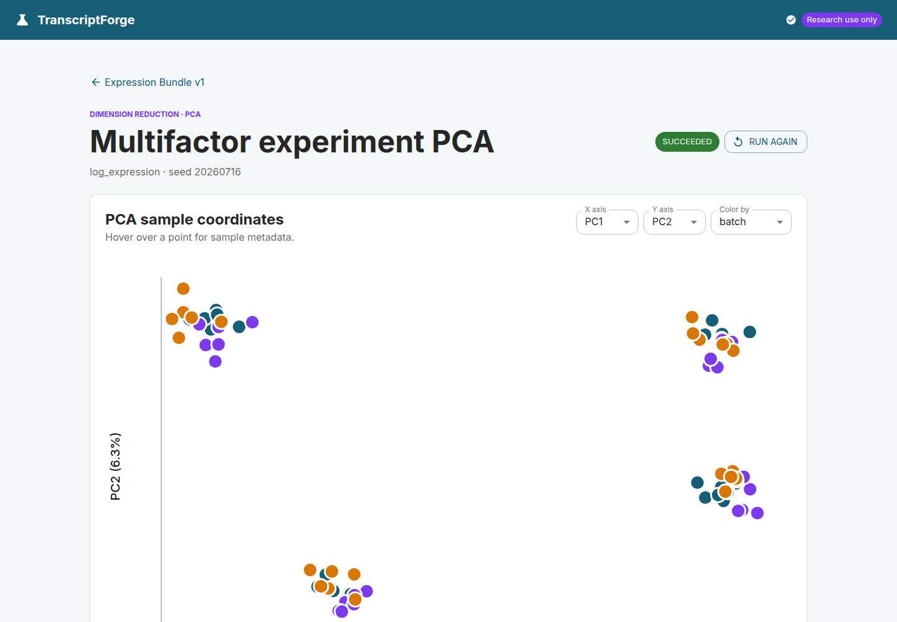
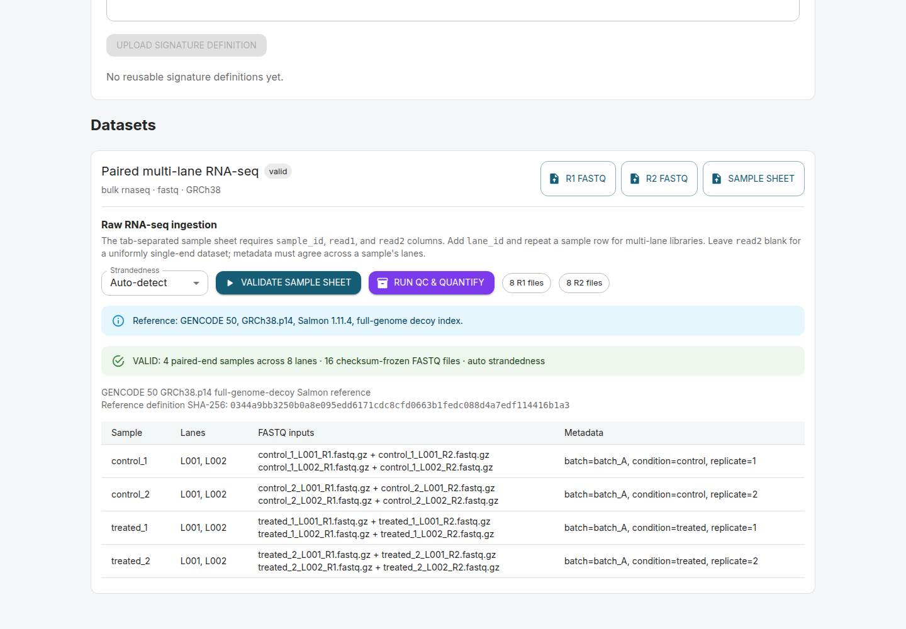
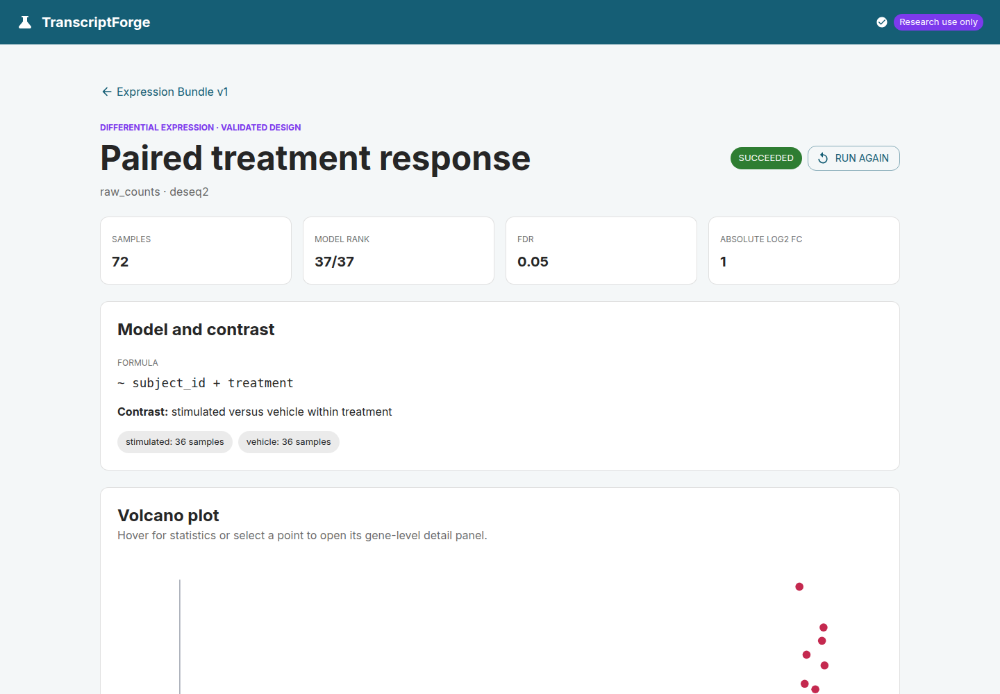
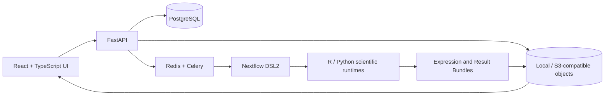

# TranscriptForge

**A full-stack, workflow-backed workbench for reproducible human transcriptomics.**

TranscriptForge takes researchers from uploaded RNA-seq or Affymetrix data to quality-controlled,
analysis-ready Expression Bundles, interactive exploration, differential expression, enrichment,
and gene-signature scoring. Every scientific run crosses a typed contract boundary, executes through
Nextflow, and publishes immutable results with checksums and software provenance.

> **Portfolio status:** the local product is operational through raw-data preparation, exploratory
> analysis, four differential-expression engines, enrichment, and six signature-scoring methods.
> Phenotype association is the next active milestone. The AWS deployment is implemented as optional
> infrastructure-as-code but has deliberately not been provisioned.



## What this project demonstrates

| Area | Evidence in the repository |
| --- | --- |
| Product engineering | React/TypeScript workflows for projects, uploads, live run state, QC, analysis design, interactive plots, tables, downloads, and provenance |
| Backend engineering | Typed FastAPI services, async SQLAlchemy/PostgreSQL persistence, Alembic migrations, object-storage adapters, and bounded Celery workers |
| Workflow engineering | Nextflow DSL2 routes for matrix preparation, raw RNA-seq, Affymetrix RMA, exploration, differential expression, enrichment, and signature scoring |
| Scientific computing | Tested Python and R implementations using NumPy/SciPy/scikit-learn, DESeq2, edgeR, limma, GSVA, and Bioconductor platform packages |
| Reproducibility | Frozen request JSON, SHA-256 input and artifact identities, immutable Expression Bundles, deterministic seeds, container/runtime versions, and downloadable execution provenance |
| Cloud architecture | Optional AWS Batch/S3/ECR/KMS/Terraform profile with scale-to-zero compute, checksum-keyed S3 references, and no persistent EFS dependency |

## Product walkthrough

### RNA-seq: inputs to interpretable results

The primary visualization study is a deterministic 72-library experiment: 36 paired donors, two
treatments, two genotypes, and three balanced processing batches across 2,000 simulated genes. The
known-effect and null blocks let the workflow test model behavior and reproducibility without
presenting simulated biology as external validation.

#### 1. Declare and validate the input contract

RNA-seq can enter as a feature-count matrix or as paired-/single-end FASTQ. Raw ingestion binds every
sample and lane to exact R1/R2 checksums, validates layout and metadata consistency, and freezes a
versioned GENCODE/GRCh38/Salmon reference definition before expensive work is enabled.



*The pre-run card exposes the sample-sheet contract, paired files, strandedness, and exact reference
release. Multi-lane libraries are represented explicitly rather than inferred from filenames.*

#### 2. Build an immutable Expression Bundle and review QC

Count matrices are validated for orientation, sample alignment, numeric integrity, duplicates, and
feature identity. Raw reads additionally run through FastQC, fastp, Salmon, tximport, and MultiQC.
Both paths converge on the same versioned Expression Bundle contract.


*The 72-sample bundle preserves raw counts and log expression, reports 100% fixture mapping, and
flags samples for review without silently excluding them.*

#### 3. Explore structure before testing hypotheses

Researchers can launch PCA, hierarchical clustering, UMAP, or t-SNE from an exact bundle version.
Runs retain configuration, seed, coordinates, static SVGs, Quarto reports, and Nextflow provenance.


*Axes and metadata coloring are interactive. The visible four-group structure reflects the seeded
genotype/treatment design, while color makes batch distribution inspectable.*

#### 4. Validate the design, then run differential expression

The API previews formulas, contrasts, replication, reference levels, design cells, and matrix rank.
The R runner independently rebuilds that model and refuses to fit if it disagrees with the frozen
preview. Raw counts support DESeq2, edgeR quasi-likelihood, and limma-voom; log expression supports
limma.



*This full-rank `~ subject_id + treatment` model compares 36 stimulated samples with their 36 paired
vehicle controls. Result pages also provide MA and p-value plots, expression heatmaps, searchable
tables, per-gene profiles, filtered downloads, reports, and run provenance.*

### Microarray: public CEL files to paired limma

The microarray walkthrough uses eight real Human Gene 1.0 ST CEL files from four matched donors in
[NCBI GEO GSE39795](https://www.ncbi.nlm.nih.gov/geo/query/acc.cgi?acc=GSE39795). It is an exploratory
engineering acceptance study, not an independent biological-validation claim.

#### 1. Verify the array platform and sample assignments

TranscriptForge reads CEL headers, checks the registered platform adapter, requires an exact
one-to-one metadata mapping, and freezes every file and adapter checksum. Unsupported arrays fail
explicitly instead of being guessed from filenames.


#### 2. Run RMA and inspect array-level QC

A dedicated Bioconductor image performs background correction, quantile normalization, probe-set
summarization, annotation, and deterministic probe-to-gene aggregation. Both probe-set and gene-level
assays remain available.


*The public fixture retains eight arrays, 257,430 probe sets, and 23,702 mapped genes. Raw and
normalized distributions, PCA, correlation, sample flags, annotation policy, and R session details
are durable artifacts.*

#### 3. Fit the matched-donor limma model

Numeric-looking donor identifiers are treated as categorical blocking levels. The server and R
boundaries independently confirm a full-rank 5/5 `~ donor + zone` design before testing the
superficial-minus-deep contrast.


## Implemented capabilities

| Workflow | Current implementation |
| --- | --- |
| Matrix ingestion | Count or normalized-expression TSV; both orientations; exact metadata matching; bounded actionable findings |
| Raw RNA-seq | Paired or single end; multiple lanes; FastQC, fastp, Salmon, tximport, MultiQC; gene and transcript abundance; checksum-keyed reference reuse |
| Affymetrix | Human Gene 1.0 ST CEL validation; `oligo` RMA; probe and gene assays; highest-MAD, median, or mean aggregation; array QC |
| Exploration | PCA, hierarchical clustering, UMAP, and t-SNE with interactive and static outputs |
| Differential expression | DESeq2, edgeR QL, limma-voom, and limma with design preview, contrast validation, result tables, plots, feature drill-down, and reports |
| Enrichment | Seeded ranked-list and over-representation analysis against checksum-versioned GMT collections |
| Gene signatures | Immutable weighted TSV/GMT definitions; Ensembl/symbol/Entrez mapping evidence; mean, z-score, weighted, rank, GSVA, and ssGSEA scoring |
| Operations | Durable run state, retries through the workflow layer, artifact indexing, local/S3-compatible storage, and opt-in AWS Batch infrastructure |

## Architecture

TranscriptForge keeps orchestration separate from scientific computation. The API validates and
freezes requests, but statistical methods live in tested R/Python programs behind Nextflow.



The durable boundaries are described in [architecture](docs/architecture.md),
[data contracts](docs/data-contracts.md), and the versioned schemas under [`schemas/`](schemas/).

### Reproducibility and safety by construction

- Uploaded names are display metadata; server-generated keys own storage paths.
- Inputs are staged from frozen URIs and rechecked against size and SHA-256 before execution.
- Nextflow is launched with an argument array, never a user-interpolated shell command.
- Prepared data and results publish only after required manifests validate against JSON Schema.
- Saved analyses reference one immutable prepared-dataset version and its exact bundle checksum.
- Scientific requests cross an API validation boundary and an independent runtime validation boundary.
- Runs retain state transitions, session identity, stdout/stderr, trace, report, timeline, DAG, parameters,
  software versions, scientific tables, plots, and report source.
- Deterministic fixtures and repeat runs compare byte-identical scientific artifacts where the method
  permits exact reproducibility.

## Technology stack

| Layer | Technologies |
| --- | --- |
| Web | React, TypeScript, Vite, Material UI, Vitest |
| API | Python 3.12+, FastAPI, Pydantic, async SQLAlchemy, Alembic |
| State and work | PostgreSQL 16, Redis, Celery, local or S3-compatible object storage |
| Workflow | Nextflow DSL2, Docker, immutable JSON contracts |
| Scientific Python | NumPy, SciPy, scikit-learn, UMAP |
| Scientific R | R/Bioconductor, DESeq2, edgeR, limma, GSVA, `oligo`, tximport |
| Reporting | Interactive React views, deterministic SVG, self-contained Quarto HTML |
| Infrastructure | Docker Compose, GitHub Actions, Terraform, optional AWS Batch/S3/ECR/KMS |

## Verification evidence

The latest full regression checkpoint records:

- 78 combined API, worker, contract, and scientific Python tests.
- 13 frontend integration tests plus ESLint and a Node 22 production build.
- Strict mypy across 60 source files and Ruff across the Python codebase.
- Containerized acceptance for all four differential-expression engines and enrichment.
- Paired/single-end and multi-lane RNA-seq acceptance, shared reference-cache reuse, and Nextflow
  `-resume` evidence.
- Eight-public-CEL RMA-to-bundle-to-paired-limma acceptance.
- Deterministic GSVA/ssGSEA fixtures with constant-gene handling and package provenance.
- JSON Schema, Docker Compose, Nextflow configuration, Alembic drift, and Terraform validation.

The detailed, run-by-run evidence and current handoff point live in
[`docs/implementation-progress.md`](docs/implementation-progress.md).

## Run locally

### Prerequisites

- Docker with Compose v2
- GNU Make
- Optional for host-side checks: Python 3.12+, Node.js 22.13+, and Nextflow 25+

### Start the product

```bash
cp .env.example .env
make dev
```

Open:

- Web application: <http://localhost:5173>
- REST API: <http://localhost:8000>
- OpenAPI documentation: <http://localhost:8000/docs>
- MinIO console: <http://localhost:9001>

### Load the 72-sample RNA-seq demonstration

```bash
make generate-large-demo
make seed-demo
```

The seed command uses the public API and durable worker path to create, validate, prepare, and
analyze the study; it is not a database fixture shortcut.

### Run verification

```bash
make test             # API, worker, contract, and frontend tests
make test-r           # four DE engines plus enrichment in the pinned worker
make test-raw-rnaseq  # paired, single-end, multi-lane, cache, and resume acceptance
make test-microarray  # public CEL -> RMA -> Expression Bundle -> paired limma
make test-all         # application tests plus the R acceptance harness
make lint             # Python and TypeScript static checks
make pipeline-test    # Nextflow smoke workflow
```

The raw RNA-seq and public microarray acceptances are intentionally heavier than unit tests. See
[`demo/raw_rnaseq/`](demo/raw_rnaseq/) and [`demo/microarray/`](demo/microarray/) for inputs,
provenance, and expected outputs.

## Repository map

```text
apps/web/           React product interface
apps/api/           FastAPI, persistence, storage, and durable workers
analysis/python/    Scientific Python packages and contract builders
analysis/r/         Differential expression, enrichment, and signature scoring
pipelines/          Nextflow workflows and process modules
schemas/            Cross-language JSON Schema contracts
containers/         Purpose-built scientific runtime images
demo/               Deterministic RNA-seq and public microarray acceptance studies
infra/aws/           Optional AWS Batch/S3 Terraform and operational tooling
docs/               Architecture, contracts, progress, security, and debt records
```

## Delivery status and honest constraints

- Phases 0–6 are complete: platform foundation through raw RNA-seq and Affymetrix workflows.
- Phase 7 has durable signature ingestion, mapping, and six scoring methods. Phenotype-aware score
  comparisons are next.
- The local build is a single-user development product. Authentication, authorization, retention,
  and deletion policy are intentionally tracked before any multi-user deployment.
- AWS resources and cost-incurring Batch parity tests require owner account, network, budget, and
  data-locality decisions; no cloud resources have been created from this repository.
- Synthetic controls establish correctness and repeatability, not biological validity. Public
  benchmarks are labeled exploratory until prespecified external validation is added.

See the owner-facing [debt register](docs/debt-register.md) for security, scientific-content,
operations, and deployment decisions that should not be hidden behind a polished demo.

> [!IMPORTANT]
> TranscriptForge is intended for research and software demonstration only. It is not clinically
> validated and must not be used for diagnosis or patient-care decisions.

## License

Licensed under the [MIT License](LICENSE).
