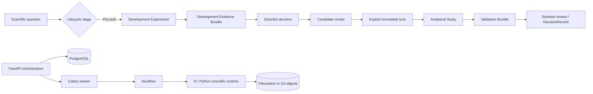

# Architecture

TranscriptForge separates product orchestration from scientific computation.



Development evidence can motivate a changed endpoint; post-lock validation cannot. Any change after
lock creates a cloned revision and preserves the original model, StudySpec, assignments, criteria,
checksums, and audit lineage.

```text
React web client
      |
      v
FastAPI REST API ---- PostgreSQL
      |              object storage
      v
Redis / Celery worker
      |
      v
Nextflow DSL2 ---- containerized R and Python programs
      |
      v
Expression Bundles / Result Bundles / provenance
```

The API validates request shape, persists records, freezes parameter JSON, and queues work. It must never implement scientific statistics. A worker launches Nextflow with an argument array, records execution identity and state transitions, and indexes published artifacts after successful manifest validation.

Local development uses filesystem-backed run storage plus MinIO for exercising the S3-compatible adapter. Production-like execution uses PostgreSQL and Redis. Scientific processes will receive purpose-built immutable containers and deterministic seeds.

Differential-expression requests cross two validation boundaries. FastAPI builds a preview model
matrix from immutable bundle metadata before a design can be saved. The R process independently
rebuilds that design and refuses to fit unless its formula, sample count, column count, and rank
match the frozen preview. Raw counts route by default to DESeq2, with edgeR quasi-likelihood and
limma-voom as explicit alternatives; continuous log-expression assays route to limma. All four
engines publish a common results table/plot boundary while retaining method-specific abundance,
normalization, filtering, and test-statistic semantics. The API performs read-only pagination, filtering, and sorting
over the immutable published table; it does not recompute statistics. Per-feature views join that
table to the engine-published normalized-expression profiles and sample metadata.

Optional enrichment remains inside the R scientific boundary. It consumes the immutable published
differential-expression table, verifies the selected GMT collection against versioned metadata and
SHA-256, and emits both seeded ranked-list and hypergeometric over-representation results. The
enrichment contract freezes the collection namespace/version/checksum, source-result checksum,
ranking and threshold parameters, and warnings. FastAPI only validates, indexes, and serves that
contract; the web client renders it without recomputing enrichment statistics.

Raw RNA-seq begins with synchronous ingestion validation rather than expensive workflow execution.
The uploaded tab-separated sample sheet is the authority that binds sample and lane identifiers to
immutable R1/R2 dataset files. A successful ingestion groups lanes only when metadata/layout agree
and publishes a normalized manifest referencing the exact
file checksums and one checksum-pinned reference definition. Only that manifest is admitted to the
FastQC/fastp/Salmon/tximport workflow, preventing filename guesses or mutable “latest” references
from entering scientific execution. Preparation rechecks every staged read, the reference-definition
digest, upstream MD5 values, local SHA-256 values, and the exact Salmon executable version. The
derived full-genome-decoy index is cached outside run directories by reference-definition digest;
gene/transcript abundances, original Salmon outputs, identifier-aware QC, MultiQC, and reference
provenance are immutable run artifacts.

Local API and worker containers share the run root. A cancellation request first moves durable state
to `CANCELLING`, then publishes a run-scoped marker. The worker observes that marker, sends SIGTERM
to the isolated Nextflow process group, escalates only after a bounded timeout, restores the
dataset's prior state, and records `CANCELLED`. The reference materializer converts SIGTERM into a
controlled exception so its atomic-build cleanup removes incomplete index directories.

Raw Affymetrix CEL preparation follows the same frozen-input boundary. The API accepts only an
explicitly registered platform adapter, scans each CEL header for a compatible platform identity,
requires exact sample-metadata assignments, and persists file and adapter checksums before queueing.
Nextflow stages those immutable inputs and delegates normalization to a platform-specific
Bioconductor image. The R process independently checks the platform package, performs RMA, maps
probe sets through transcript clusters to Ensembl genes, and emits probe-level and aggregated
gene-level assays plus QC and full session provenance. Python then validates and archives the
canonical Expression Bundle; the API only indexes and serves its immutable artifacts.

The optional AWS profile changes execution configuration, not workflow code. A Nextflow head process
uses short-lived AWS credentials to submit each process to AWS Batch; S3 is the remote work and
publication boundary. Every Batch process uses the same ECR image pinned by digest. Reference
materializations use an immutable S3 prefix derived from the exact reference-definition SHA-256 and
materializer schema version. The manifest is uploaded last as a completion marker; consumers
download every declared object and revalidate its SHA-256 before use. This avoids a persistent EFS/NFS
control plane while retaining cross-run reference reuse. See the deployment threat model for the IAM,
encryption, network, and residual-risk boundaries.

Candidate gene signatures are orchestration records, not new statistical results. A draft belongs
to one project and references the exact prepared dataset, differential-expression analysis, and
successful source run. It stores selected feature identifiers, snapshots their published result
rows, and records the immutable result artifact identifier and SHA-256 checksum. This preserves the
selection decision even if later runs produce different estimates. Candidate drafts are kept
separate from trained `ModelRecord` objects and never imply independent or clinical validation.

Reusable signature definitions have a separate trust boundary from candidate drafts. Bounded
gene-list/GMT uploads are parsed synchronously into a schema-valid immutable manifest; both source
and manifest objects are checksum-frozen under the owning project. Mapping reads only published
Expression Bundle feature metadata and reports exact mapped, missing, ambiguous, and duplicate
identifiers. The API persists one immutable mapping per definition/bundle pair with the exact source
checksums, report JSON, and downloadable missing/ambiguous tables. The UI requires this report to be
visible before scoring; per-sample scoring remains assigned to the scientific workflow, not the API.
Saved signature analyses reference that immutable mapping record. Each run freezes the mapping report,
Expression Bundle checksum, and method parameters. Nextflow dispatches mean-expression, mean-z-score,
weighted-linear, or rank-based scoring to the Python scientific package and GSVA/ssGSEA to the
Bioconductor R runtime. Both routes publish the same schema-valid score tables, final-feature
inventories, plots, reports, checksums, and explicit software provenance; the API only orchestrates
and indexes those outputs. A deterministic cross-modality acceptance freezes one weighted Ensembl
signature and scores it independently in RNA-seq-derived log2 CPM and microarray RMA-like bundles.
Its contract compares mapping coverage, within-cohort direction, rank discrimination, association,
and standardized effects while explicitly setting raw-score scale comparability to false. No matrix
merging, shared raw threshold, or platform-equivalence claim is permitted.

A second, public technical benchmark uses the paired human-cartilage GSE39795 Expression Bundle and
prespecified superficial/deep marker directions. Its versioned policy requires at least 80% mapping,
four samples per group, the expected direction for every set, directional AUROC at least 0.80,
association FDR at most 0.05, and a byte-identical repeat before a method is eligible as the product
default. The fixed preference order recommends mean z-score for within-cohort work. Coverage below
80% remains runnable for exploration but is visibly cautioned, and no raw cutoff is portable across
cohorts, platforms, or preprocessing. Because the marker publication includes the benchmark cohort,
this evidence is explicitly technical rather than independent biological validation.

Cell-type deconvolution is governed by a checksum-versioned method registry before any scientific
runner is selected. Each entry declares native versus external execution, fraction versus enrichment
output, units, composition constraints, valid within-/between-sample comparisons, organism, gene
identifier namespace, assay name/scale/value type, minimum reference overlap, and reference choices.
The API evaluates those declarations against the assay and feature-metadata records inside the
immutable Expression Bundle; a prepared-dataset capability response never infers suitability from an
assay name alone. Saved designs freeze the complete method entry, registry checksum, exact assay
descriptor, reference choice, and overlap threshold. quanTIseq, MCP-counter, and xCell are executable
through the same audited boundary. Their exact upstream sources and reference assets/objects are
checksum-pinned; every run audits effective overlap after gene-symbol mapping and method-specific
duplicate handling, and the worker validates structured results before indexing artifacts. EPIC
remains unlaunchable until its separate license workflow and acceptance fixture pass.

The result contract preserves this distinction downstream: EPIC and quanTIseq emit cell fractions
with per-sample composition summaries, while MCP-counter and xCell emit non-compositional enrichment
scores in arbitrary units. Enrichment visualization uses within-population z-scores only for color
while preserving raw values, and the UI never shows those scores as percentages or renormalizes them
to sum to one. Cross-method sections require identical result type/unit, assay semantics, sample
order, and Expression Bundle checksum. References remain method-specific: only exact population
identifier-and-label intersections are compared, and Pearson correlation describes a population's
sample pattern rather than equivalence of raw method scales. Malformed or incomplete result artifacts
are excluded with an explicit reason. CIBERSORTx remains external-only and never becomes a local or
cloud dependency: the adapter accepts relative-mode exports only, validates exact bundle samples and
fraction composition, and freezes the original file/checksum, selected TPM assay, declared gene
overlap, signature identity/version/checksum, mode, batch correction, permutations, and external
runtime/run identity. TranscriptForge never handles CIBERSORTx credentials or claims to reproduce
the external computation.

Classifier development starts with a server-side split audit rather than model fitting. A saved
binary or multinomial elastic-net design names the outcome, repeated experimental-unit boundary,
optional cohort label, fold dimensions, metric, and all preprocessing choices; binary designs also
freeze the positive class, calibration, and threshold policy. The API deterministically constructs
every repeated outer split, proves that groups never overlap, verifies that every outer and inner
partition contains all expected classes, and freezes that plan with the analysis. Its leakage
policy requires variance filtering, standardization, feature selection, calibration, threshold
selection, and hyperparameter tuning to be fitted only from the applicable training partitions;
outer test data is evaluation-only. The scientific worker independently rebuilds the frozen split
plan, rejects any disagreement or group overlap, and publishes exactly one OOF probability vector
per sample per repeat. Structured results preserve fold-specific hyperparameters, fit-scope hashes,
core metrics, feature stability, and bundle/software provenance. An adversarial acceptance test fails
an intentionally test-aware preprocessing scope and passes the production implementation. Published
binary results add group-bootstrap uncertainty, ROC/PR/calibration/confusion diagnostics, fully
re-tuned label permutations, learning curves, and random-forest/boosted-tree comparisons evaluated on
the same outer partitions. Independent binary permutations use index-derived seeds and a bounded
process pool whose worker count comes from the Nextflow CPU allocation; arrays are memory-mapped,
native math threads are capped at one per worker, completion progress is streamed, and results are
restored to permutation-index order. Multinomial results add macro ROC-AUC/F1, balanced accuracy, one-vs-rest
ROC coordinates, classwise confusion and feature stability, and full nested label permutations.
Only elastic net is locked: its features, scaling, coefficients and intercepts—and, for binary runs,
calibration and threshold—are stored with a research-only model card and inference schema after
internal validation is complete. The separate `PREDICT_WITH_MODEL` workflow consumes that immutable
model and a new Expression Bundle, requires every frozen feature, reproduces the locked recipe, and
publishes class probabilities plus exact model/bundle checksums.

The first real classifier transportability study is separately frozen in a schema-valid prospective
protocol: GSE140494 is development-only and GSE32646 is the one-use external cohort. The protocol
allows outcome-blind external preparation before model lock, but forbids joining response truth,
refitting, recalibration, threshold changes, or cohort replacement until checksummed predictions
exist. The protocol was executed once: external ROC-AUC was 0.619 (95% bootstrap 0.503–0.726), so
the lower-bound criterion passed but the frozen 0.65 point-estimate criterion did not. This honest
negative primary result permits no post-hoc refit or successful external-validation claim.

## Service boundaries

- `apps/api`: HTTP API, persistence, storage abstraction, queueing, and run orchestration.
- `apps/web`: typed UI, forms, run monitoring, and manifest-driven result rendering.
- `pipelines`: workflow routing, channel wiring, and process definitions.
- `analysis`: tested scientific libraries and thin command-line wrappers.
- `schemas`: cross-language contracts for every durable bundle and request.
- `containers`: scientific runtime image definitions.
- `infra/aws`: opt-in AWS Batch/S3 infrastructure, validation, and deployment guidance.

## Trust boundaries

Uploaded names are display metadata only. Server paths and object keys are generated internally. User data is never interpolated into a shell string. Nextflow is launched with a fixed executable and an argument list. Artifact serving must resolve paths inside the owning run namespace.

The AWS data plane denies insecure S3 transport and public access, defaults objects to SSE-KMS, and
limits job access to `inputs/`, `references/`, `work/`, and `results/`. The submitter can register
Nextflow's dynamic job definitions and pass only the dedicated task role. Static access keys are not
part of the profile. Full controls and residual owner decisions are recorded in
[`aws-batch-threat-model.md`](aws-batch-threat-model.md).
